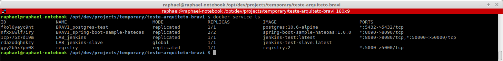
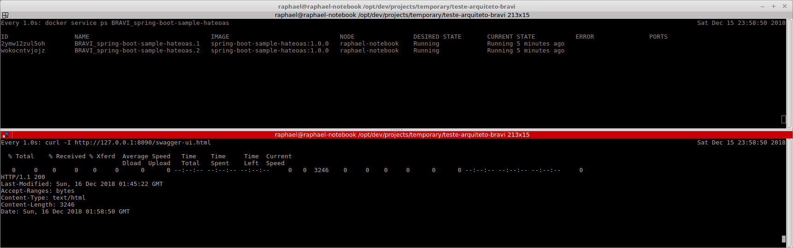
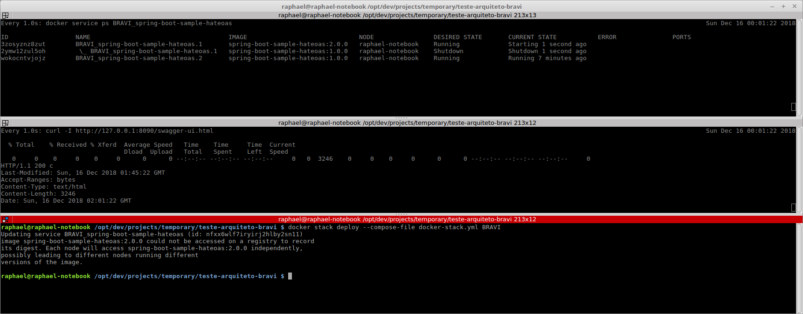
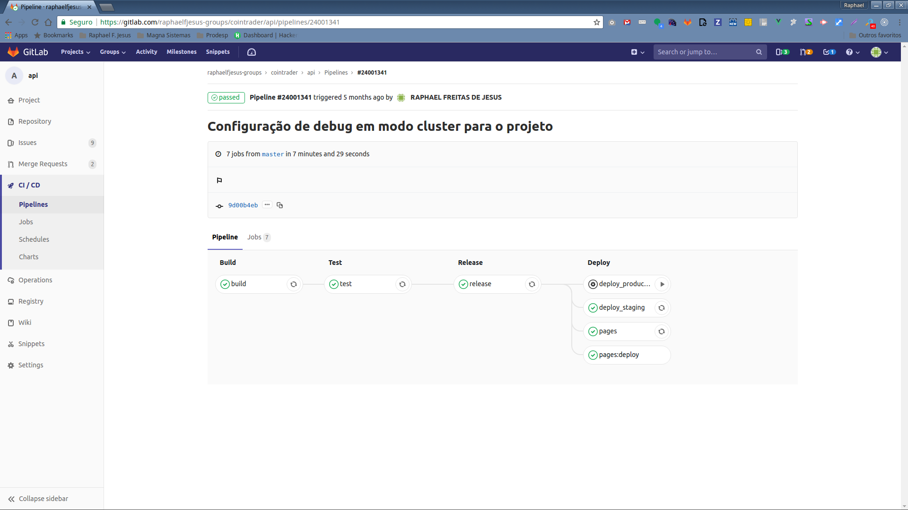
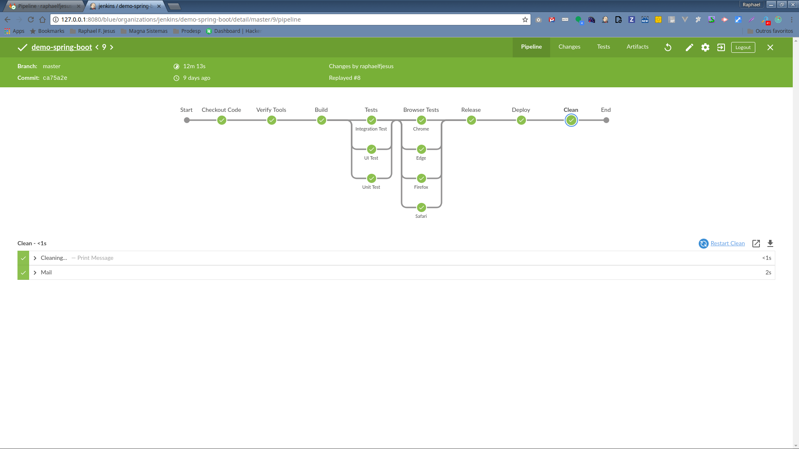

# Bravi Software - Teste para vaga de Arquiteto DevOps

Este documento tem como objetivo demonstrar os passos necessários para validar as implementações submetidas pelos candidados à vaga de Arquiteto DevOps na Bravi Software.

Tabela de conteúdo
==================

- [Pré-requisitos](#pré-requisitos)
- [Tarefas](#tarefas)
  - [Tarefa 1 Migrar a persistência para Postgresql ou MySQL](#tarefa-1-migrar-a-persistência-para-postgresql-ou-mysql)
  - [Tarefa 2 Empacotar a aplicação usando Docker e implantá-la usando uma ferramenta de orquestração compatível com Docker](#tarefa-2-empacotar-a-aplicação-usando-docker-e-implantá-la-usando-uma-ferramenta-de-orquestração-compatível-com-Docker)
  - [Tarefa 3 Implementar atualização sem afetar disponibilidade usando Docker em uma ferramenta de orquestração compatível com Docker](#tarefa-3-implementar-atualização-sem-afetar-disponibilidade-usando-docker-em-uma-ferramenta-de-orquestração-compatível-com-docker)
- [Sugestões](#sugestões)
  - [Implementar mecanismo de monitoramento de health check do serviços](#implementar-mecanismo-de-monitoramento-de-health-check-do-serviços)
  - [Automatizar o deploy utilizando alguma ferramenta para CI/CD](#automatizar-o-deploy-utilizando-alguma-ferramenta-para-CI/CD)
- [Referências](#referências)

## Pré-requisitos

Antes de iniciar a execução das tarefas descritas no teste em pauta, certifique-se que as seguintes ferramentas estão disponíveis em seu ambiente:

- [Git](https://git-scm.com/)
- [JDK 8+](https://www.oracle.com/technetwork/java/javase/downloads/jdk8-downloads-2133151.html)
- [Maven 3.3+](https://maven.apache.org/download.cgi)
- [Docker 1.17+](https://docs.docker.com/install/)
- [Docker Swarm](https://docs.docker.com/engine/swarm/swarm-tutorial/)
- [cURL](https://curl.haxx.se/docs/manpage.html)
- [watch](https://linux.die.net/man/1/watch)

Para assegurar que as ferramentas citadas acima estão devidamente instaladas no ambiente, execute os comandos abaixo:

```shell
# Printa a versão do Git instalado na máquina
git --version

# Printa a versão da JDK instalada na máquina
java -version

# Printa a versão do Maven instalado na máquina
mvn --version

# Printa a versão do Docker instalado na máquina
docker --version

# Printa a versão do cURL instalado na máquina
curl --version

# Printa a versão do watch instalado na máquina
watch --version
```


## Tarefas

### Tarefa 1 Migrar a persistência para Postgresql ou MySQL

Para execução dessa tarefa, será utilizado o banco de dados PostgreSQL.

>**Nota:** Tenha certeza que as portas `8090` e `5432` utilizadas pela aplicação e banco de dados respectivamente, não estão em uso por outros processos em seu ambiente.

1) Nesta etapa, será demonstrado os passos necessários para criação do banco de dados que será utilizado pela aplicação.

```shell
# Cria um container Docker a partir da imagem oficial do PostgreSQL expondo-o na porta 5432
docker run --name postgres-test -p 5432:5432 -e POSTGRES_USER=postgres -e POSTGRES_PASSWORD=postgres -e POSTGRES_DB=postgres -d postgres:10.6-alpine
```


2) A partir do diretório raiz do projeto, empacote a aplicação (formato `.jar`) e execute-a a partir de um terminal, conforme descrito abaixo.

```shell
# Execute o empacotamento da aplicação utilizando o Maven
mvn clean package
```


```shell
# Inicie a aplicação empacotada via terminal
java -jar target/spring-boot-sample-hateoas-2.0.1.RELEASE.jar
```


3) Com a aplicação inicializada, acesse a URL `http://localhost:8090/swagger-ui.html` a partir do seu navegador favorito e teste-a utilizando os recursos do Swagger.


### Tarefa 2 Empacotar a aplicação usando Docker e implantá-la usando uma ferramenta de orquestração compatível com Docker

Para execução dessa tarefa, será utilizado o [Docker Swarm](https://docs.docker.com/engine/swarm/) como ferramenta de orquestração de containers Docker.

1) Inicie o docker swarm em seu ambiente, executando os comandos abaixo:

```shell
# Inicializa o orquestrador de containers na máquina
docker swarm init
```

2) Com o orquestrador de containers inicializado, inicie o container do PostgreSQL como serviço.

```shell
# Execute o comando abaixo a partir do diretório raiz do projeto
docker stack deploy --compose-file docker-stack-infra.yml BRAVI
```


>**Nota:** Garanta que a porta `5432` utilizada pelo PostgreSQL não esteja em uso.

3) Em seguida, a partir do diretório raiz do projeto, gere a imagem docker da aplicação e implante-a como serviço, conforme configuração contida no arquivo `docker-stack.yml`.

```shell
# Constrói a imagem docker da aplicação 
docker build --tag spring-boot-sample-hateoas:1.0.0 .

# Execute o comando abaixo para implantar a aplicação como serviço sob o namespace BRAVI
docker stack deploy --compose-file docker-stack.yml BRAVI

# Confirme se o serviço foi criado corretamente
docker service ls
```


>**Nota:** Para visualizar os logs gerados pela aplicação implantada como serviço, utilize o comando `docker service logs BRAVI_spring-boot-sample-hateoas` a partir do terminal.

4) Na sequência, usando seu navegador favorito, acesse a URL `http://127.0.0.1:8090/swagger-ui.html` e teste a aplicação utilizando os recursos do Swagger.


5) Agora, simule a queda de um dos containers associados ao serviço da aplicação e veja como a aplicação se comporta para o usuário final. Para executar esse passo, todos os comandos descritos abaixo devem ser executados em terminais diferentes.

```shell
# Diminua a réplica do serviço de 2 para 1
docker service scale BRAVI_spring-boot-sample-hateoas=1

# Lista todos os containers em execução a cada meio segundo
watch -n 0.5 docker ps

# Testa o endpoint da aplicação a cada 1 segundo
watch -n 1 curl -I http://127.0.0.1:8090/swagger-ui.html
```


### Tarefa 3 Implementar atualização sem afetar disponibilidade usando Docker em uma ferramenta de orquestração compatível com Docker

Para realizar essa tarefa, será preciso ajustar alguns parâmetros de configurações do **.yml**.

**Atenção**: Tenha certeza que o container do PostgreSQL está em execução, conforme descrito na [tarefa 2](#tarefa-2-empacotar-a-aplicação-usando-docker-e-implantá-la-usando-uma-ferramenta-de-orquestração-compatível-com-Docker).

1) A partir do diretório raiz do projeto, execute os comandos abaixo para gerar a imagem da aplicação e na sequência implantá-la como serviço.

```shell
# Constrói a imagem docker da aplicação
docker build --tag spring-boot-sample-hateoas:1.0.0 .

# Execute o comando abaixo para implantar a aplicação como serviço
docker stack deploy --compose-file docker-stack.yml BRAVI
```



2) Antes de prosseguir com a atualização da aplicação, execute os comandos a seguir em terminais diferentes, permitindo o monitoramento do estado da aplicação.

```shell
# Lista todos os containers em execução (refresh a cada segundo)
watch -n 1 docker service ps BRAVI_spring-boot-sample-hateoas

# Testa o endpoint da aplicação a cada segundo
watch -n 1 curl -I http://127.0.0.1:8090/swagger-ui.html
```



3) Com os terminais de monitoramento em execução, abra outro terminal e execute os comandos listados abaixo para gerar uma nova imagem que contemple alguma alteração da aplicação e na sequência, implante-a como serviço.

```shell
# Edite o arquivo docker-stack.yml para alterar a versão da imagem De "1.0.0" Para "2.0.0"
vi docker-stack.yml
:wq

# Construa a imagem docker da aplicação, versionando-a em 2.0.0
docker build --tag spring-boot-sample-hateoas:2.0.0 .

# Atualiza a aplicação já em execução
docker stack deploy --compose-file docker-stack.yml BRAVI
```



>**Nota:** Ignore o warning exibido durante a atualização do serviço, pois isso é devido a não configuração de um registry (fora do escopo da tarefa), sendo necessário em ambiente clusterizado.

## Sugestões

Existem diversas maneiras de atender os itens descritos abaixo, porém vou sugerir apenas procedimentos e ferramentas que tenho vivência profissional.

### Implementar mecanismo de monitoramento de health check do serviços

1) O sistema deve disparar um alerta para o responsável informando que ele se encontra inoperante e qual possível motivo ex: falta de conexão com banco de dados.

Hoje em dia esse tipo de serviço é chamado de **Status Page**, onde é exibida uma página com o status de todos os endpoints configurados para monitoramento. Nessas ferramentas é possível configurar os tipos de falha que deseja tornar pública ou privada, bem como a lista de pessoas que serão notificadas (Slack, E-mail, SMS, entre outros) em caso de falha ou recuperação. Abaixo estão algumas soluções (pagas e open source) nesse segmento:

**Soluções pagas**
- [Statuspage](https://www.statuspage.io/)
- [Statuspal](https://statuspal.io/)
- [Status.io](https://status.io/)

**Soluções open source**
- [Cachet](https://cachethq.io/)
- [Staytus](https://staytus.co/)

2) Assim que o sistema se recuperar, um alerta também deve ser enviado informando o novo status.

A solução proposta/descrita no item anterior atende essa situação.

3) Se existir um centralizador de logs, seria interessante o alerta conter um review das últimas X linhas de log ou um link para visualizar os logs.

Os logs poderiam ser coletados com o [FileBeat](https://www.elastic.co/products/beats/filebeat) e armazenados no [Elasticsearch](https://www.elastic.co/products/elasticsearch), onde sua visualização se daria pelo [Kibana](https://www.elastic.co/products/kibana). Com o kibana disponível, poderia utilizar sua própria API para montar a query responsável por capturar os logs, especificando os containers com falha e data/hora do evento.

O envio poderia ser feito a partir das ferramentas já citadas ou da criação de um script para isso.

### Automatizar o deploy utilizando alguma ferramenta para CI/CD

Isso pode ser feito através da configuração de pipeline em ferramentas de automação, onde cada estágio é responsável por executar uma determinada tarefa. O fluxo mais básico de um pipeline consiste em:

- **Checkout:** Baixa o código fonte do projeto a partir de um repositório;
- **Build:** Constrói os artefatos da aplicação, empacotando-a no formato da linguagem (por exemplo `.jar`) e gera sua respectiva imagem docker, publicando-a no repositório de imagens da organização;
- **Test:** Testa a imagem publicada, baixando-a e executando seus respectivos testes. Nesse momento é possível configurar a interrupção do pipeline em caso de falha, evitando a implantação de aplicações quebradas;
- **Release:** Com a imagem testada, baixamos e a rotulamos para uma versão estável, publicando-a novamente para o repositório de imagens;
- **Deploy staging:** Implanta a imagem estável no ambiente de homologação, alertando as pessoas envolvidas que uma nova atualização da aplicação está disponível; e
- **Deploy production:** Após a homologação ter sido realizada, a implantação da imagem pode ser disponibilizada no ambiente de produção manualmente, bastando a pessoa responsável proceder ou não com a ação.

Exemplo de pipelines configurados em alguns projetos pessoais:

**Gitlab CI**


**Jenkins**


1) Um deploy deve ser disparado assim que um push ocorrer para uma branch X.

Basta configurar um `webhook` no repositório, especificando a URL do serviço responsável pela automação do deploy. Lembre-se que a maioria das ferramentas de automação (Jenkins, Gitlab CI, Circle CI, Travis CI, Codeship, entre outras) permite configurar sua execução baseada em branches.

2) Se possível disponibilizar deploys de branchs diferentes para ambientes diferentes, como por exemplo: a branch master realizando deploy para produção e a branch develop/hmg para um ambiente de homologação.

Isso é possível em qualquer ferramenta, bastando configurar no estágio responsável pelo deploy, que se o código baixado for originado a partir de uma branch em específico, execute o shell script necessário para implantação naquele ambiente.

3) O Deploy só deve ser concluído se todos os testes existentes passarem com sucesso.

Basta realizar a configuração no estágio de **Test**, conforme descrito no início dessa seção.

## Referências

- [Git - Documentação](https://git-scm.com/doc)
- [JDK - Documentação](https://docs.oracle.com/javase/8/docs/)
- [Maven - Documentação](https://maven.apache.org/guides/index.html)
- [Docker - Documentação](https://docs.docker.com/)
- [Docker Swarm - Documentação](https://docs.docker.com/engine/swarm/)
- [PostgreSQL - Documentação](https://www.postgresql.org/docs/10/index.html)
- [PostgreSQL - Imagem oficial no Docker Store](https://docs.docker.com/samples/library/postgres/)
- [Gitlab CI - Documentação](https://docs.gitlab.com/ce/ci/)
- [Jenkins Pipeline - Documentação](https://jenkins.io/doc/book/pipeline/)

