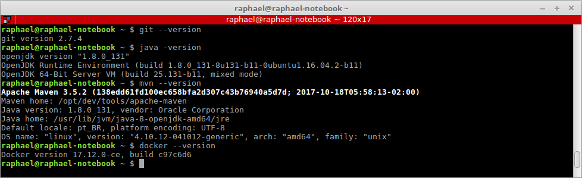
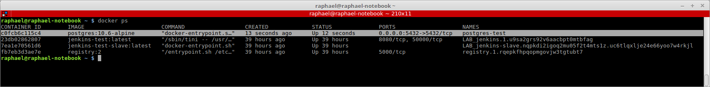
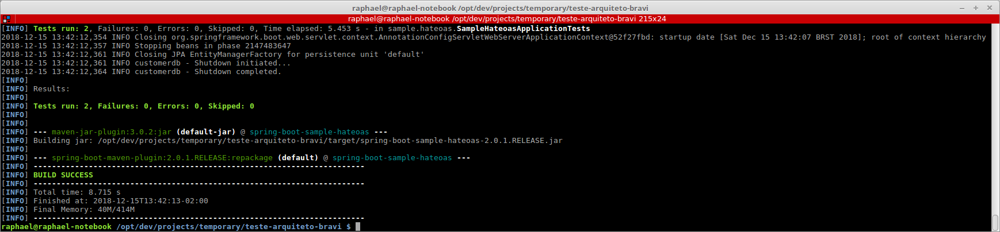
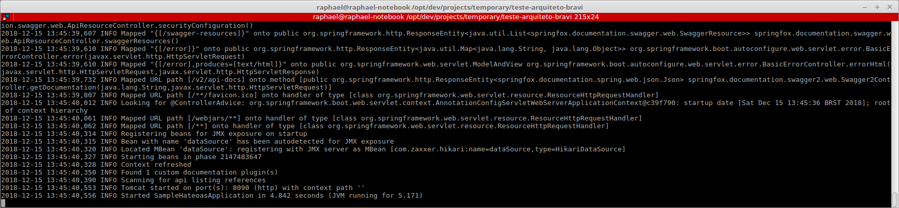
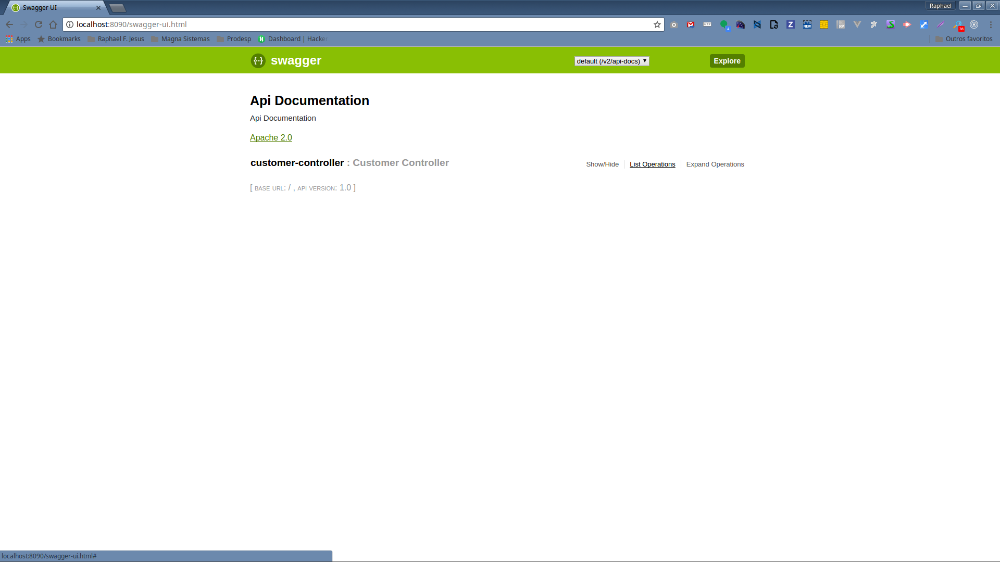

# Bravi Software - Teste para vaga de Arquiteto DevOps

Este documento tem como objetivo demonstrar os passos necessários para validar as implementações submetidas pelos candidados à vaga de Arquiteto DevOps na Bravi Software.

Tabela de conteúdo
==================

- [Pré-requisitos](#pré-requisitos)
- [Tarefas](#tarefas)
  - [Tarefa 1: Migrar a persistência para Postgresql ou MySQL](#tarefa-1:-migrar-a-persistência-para-postgresql-ou-mysql)
- [Referências](#referências)

## Pré-requisitos

Antes de iniciar a execução das tarefas descritas no teste em pauta, certifique-se que as seguintes ferramentas estão disponíveis em seu ambiente:

- [Git](https://git-scm.com/)
- [JDK 8+](https://www.oracle.com/technetwork/java/javase/downloads/jdk8-downloads-2133151.html)
- [Maven 3.3+](https://maven.apache.org/download.cgi)
- [Docker 1.17+](https://docs.docker.com/install/)

Para assegurar que as ferramentas citadas acima estão devidamente instaladas no ambiente, execute os comandos abaixo:

```shell
# Printa a versão do Git instalado na máquina
git --version

# Printa a versão da JDK instalada na máquina
java -version

# Printa a versão do Maven instalado na máquina
mvn --version

# Printa a versão do Docker instalado na máquina
docker --version
```



## Tarefas

## Tarefa 1: Migrar a persistência para Postgresql ou MySQL

Para execução dessa tarefa, será utilizado o banco de dados PostgreSQL.

1) Nesta etapa, será demonstrado os passos necessários para criação do banco de dados que será utilizado pela aplicação.

```shell
# Execute o comando abaixo para criar um container Docker a partir da imagem oficial do PostgreSQL expondo-o na porta 5432
docker run --name postgres-test -p 5432:5432 -e POSTGRES_USER=postgres -e POSTGRES_PASSWORD=postgres -e POSTGRES_DB=postgres -d postgres:10.6-alpine
```



2) A partir do diretório raiz do projeto, empacote (formato .jar) a aplicação e execute-a a partir de um terminal, conforme descrito abaixo.

```shell
# Execute o empacotamento da aplicação utilizando o Maven
mvn clean package
```



```shell
# Inicie a aplicação empacotada via terminal
java -jar target/spring-boot-sample-hateoas-2.0.1.RELEASE.jar
```



3) Com aplicação inicializada, acesse a URL `http://localhost:8090/swagger-ui.html` a partir do seu navegador favorito e teste a aplicação utilizando os recursos do Swagger.



>**Nota:** Tenha certeza que as portas `8090` e `5432` utilizadas pela aplicação e banco de dados respectivamente, não estão em uso por outros processos em seu ambiente.

## Referências

- [Git - Documentação](https://git-scm.com/doc)
- [JDK - Documentação](https://docs.oracle.com/javase/8/docs/)
- [Maven - Documentação](https://maven.apache.org/guides/index.html)
- [Docker - Documentação](https://docs.docker.com/)
- [PostgreSQL - Documentação](https://www.postgresql.org/docs/10/index.html)
- [PostgreSQL - Imagem oficial no Docker Store](https://docs.docker.com/samples/library/postgres/)

